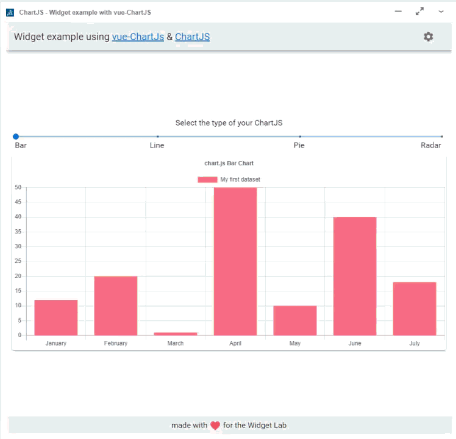

# ChartJS widget
This example shows how we can display a chart in a widget with ChartJS. Copied from the Widget Lab community under permission of Romain Bouleis (16th April 2021 - High Charts library question in the community).

You can also edit the dataset and the options of the chart.

It is based on the Vue.js and Vuetify widget template.



## Installation

### 1. Get the sources

If you are familiar with Git, clone our repo

```bash
git clone https://github.com/nogueiraantonio/ds-widgetlab-chartjs.git
```

### 2. Install the development dependencies

```bash
npm install
```

### 3. Start the Widget

```bash
npm run start
```

## Development commands

| Command            | Description                                                       |
| ------------------ | ----------------------------------------------------------------- |
| `npm run start`    | Build app continuously and serve @ `http://localhost:8081/widget` |
| `npm run startS3`  | Build app continuously to `/dist/` and serve through AWS S3       |
| `npm run build`    | Build app to `/dist/`                                             |
| `npm run devtools` | Open the devtools                                                 |
| `npm run lint`     | Run ESLint                                                        |
| `npm run lintFix`  | Run ESLint and fix issues                                         |
